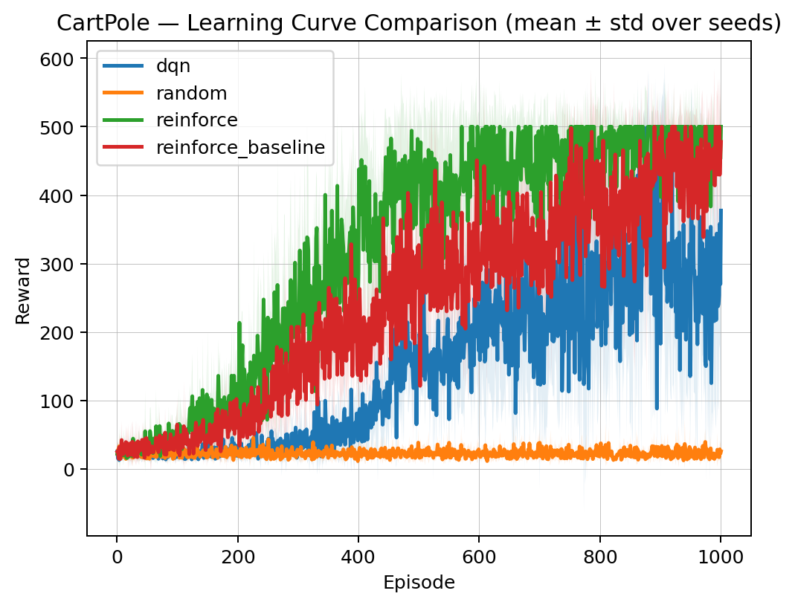
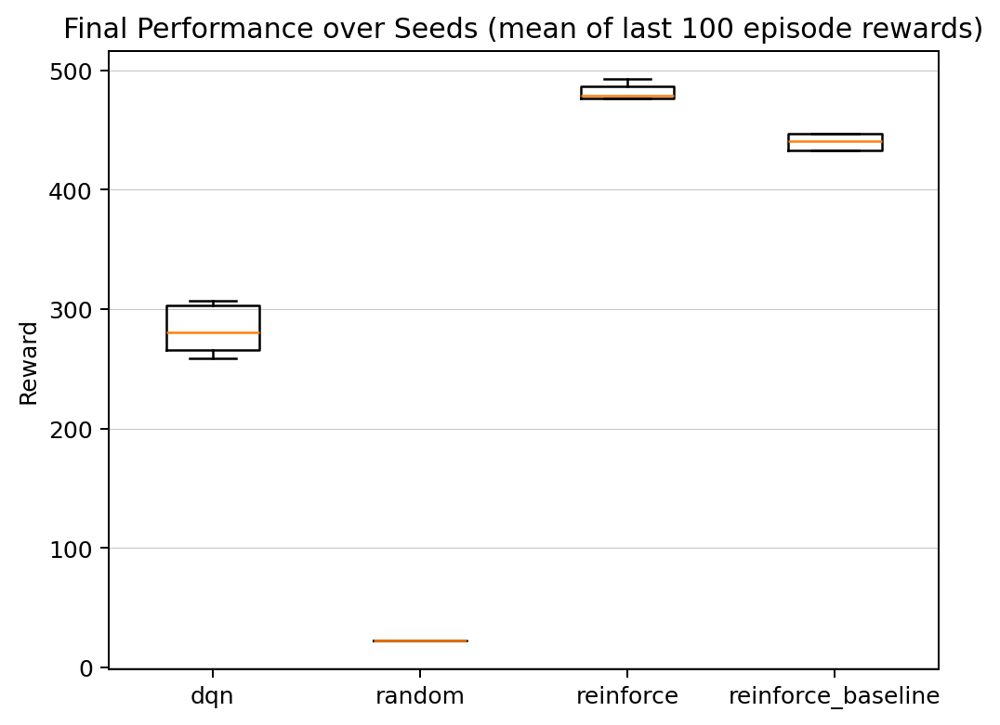
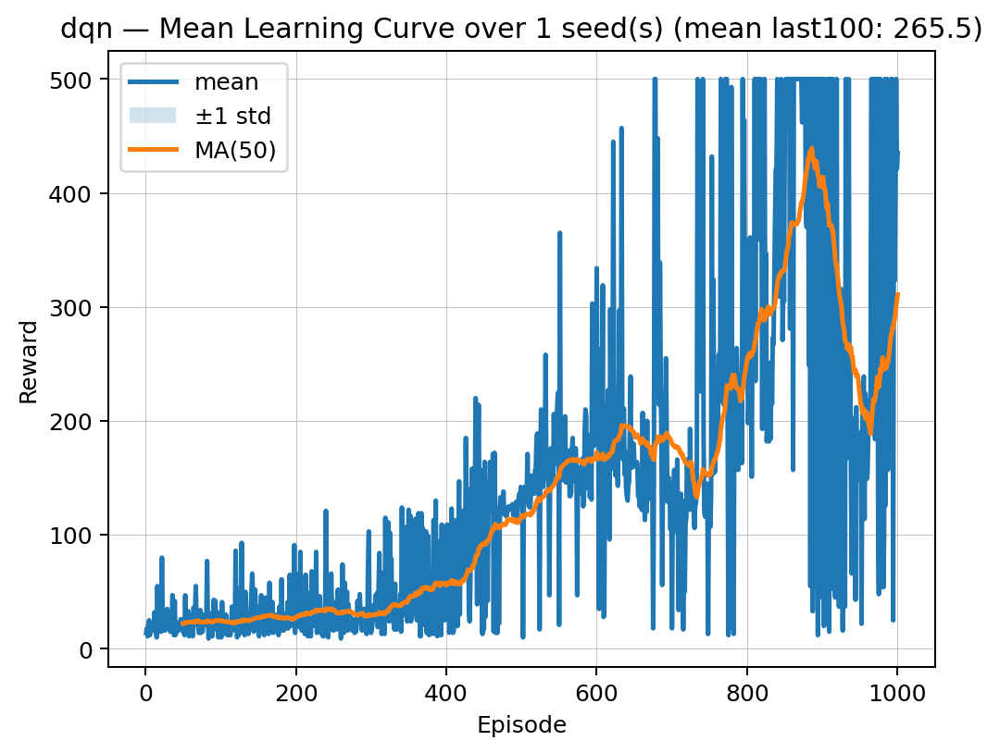
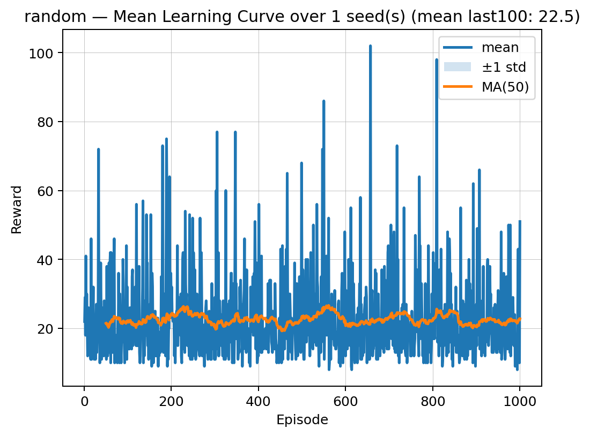
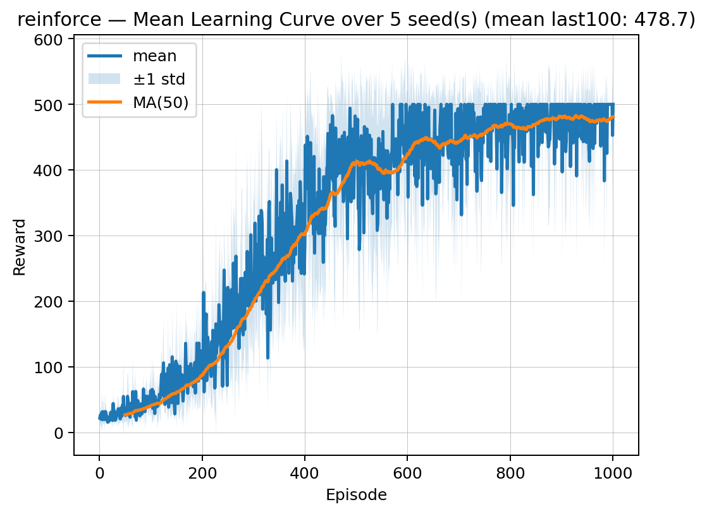
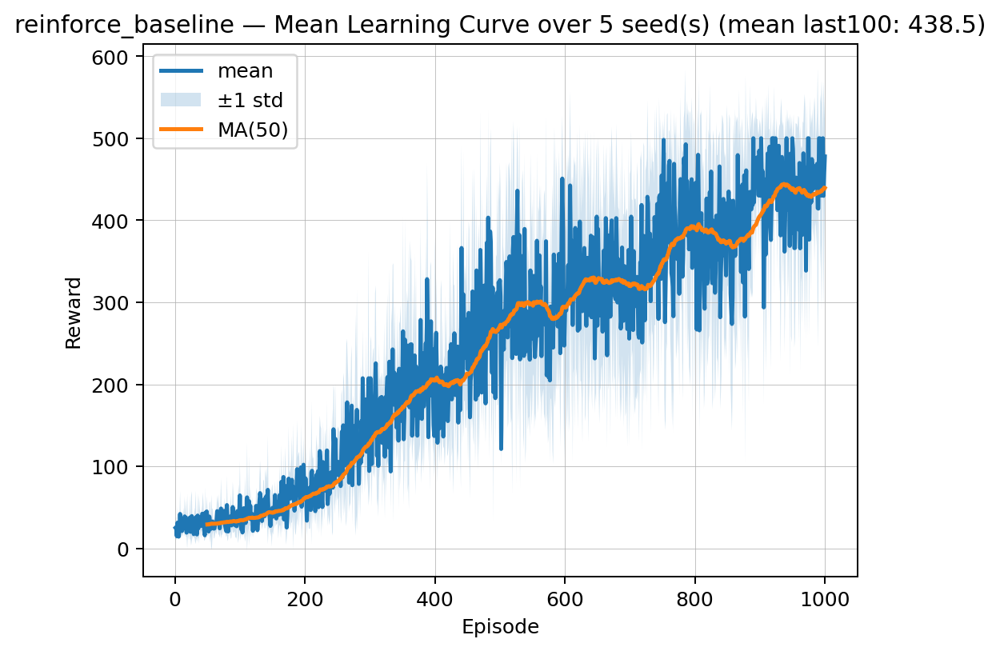

# cartpole-rl-baselines

Reinforcement Learning baselines on **CartPole-v1** implemented from scratch in PyTorch.

## Implemented Agents

- **Random**
- **REINFORCE** (Monte Carlo policy gradient)
- **REINFORCE + Baseline** (value function baseline / advantage)
- **DQN** (Deep Q-Network)

This repository includes standardized multi-seed training runs and an automated reporting pipeline that generates comparison plots for clean, reproducible benchmarking.

---

## Results (CartPole-v1)

### Setup

- Episodes per run: **1000**
- Seeds: **5 (0–4)**
- Metric: **Mean reward over the last 100 episodes**
- Reported as: **Mean ± Standard Deviation across seeds**

| Agent              | Seeds | Final Performance (mean ± std) |
|--------------------|:-----:|:------------------------------:|
| dqn                |   5   | 282.97 ± 19.50                 |
| random             |   5   | 22.47 ± 0.90                   |
| reinforce          |   5   | 478.66 ± 11.56                 |
| reinforce_baseline |   5   | 438.47 ± 21.60                 |

---

## Learning Curve Comparison



---

## Final Performance Distribution (Boxplot over Seeds)



---

## Per-Agent Mean Learning Curves

### DQN



### Random



### REINFORCE



### REINFORCE + Baseline



---

# How to Run

## 1) Install Dependencies

```bash
pip install -r requirements.txt
```

---

## 2) Train Agents

All training scripts support the arguments `--episodes` and `--seed`.

### Example: Train each agent with a single seed

```bash
py -m training.train_random --episodes 1000 --seed 0
py -m training.train_reinforce --episodes 1000 --seed 0
py -m training.train_reinforce_baseline --episodes 1000 --seed 0
py -m training.train_dqn --episodes 1000 --seed 0
```

### Train all agents across multiple seeds (0–4)

```bash
for s in 0 1 2 3 4; do
  py -m training.train_random --episodes 1000 --seed $s
  py -m training.train_reinforce --episodes 1000 --seed $s
  py -m training.train_reinforce_baseline --episodes 1000 --seed $s
  py -m training.train_dqn --episodes 1000 --seed $s
done
```

---

## 3) Generate Plots and Report

This reads all JSON files in `results/runs/` and regenerates the comparison plots used in this README.

```bash
py scripts/make_report.py
```

---

# Project Structure

```
src/                    # environment helpers + agent implementations
src/agents/             # random, reinforce, reinforce_baseline, dqn
training/               # standardized training scripts
scripts/make_report.py  # aggregates runs and generates plots
results/runs/           # JSON logs (per agent, per seed)
docs/assets/plots/      # generated figures used in README
```

---

# Notes

- The **Random** agent provides a sanity-check baseline (~22 reward).
- **REINFORCE** achieved the strongest performance in this setup.
- **REINFORCE + Baseline** improves stability but slightly underperforms vanilla REINFORCE here.
- **DQN** performance is sensitive to hyperparameters (epsilon schedule, learning rate, target updates).
- The reporting pipeline aggregates across seeds to provide statistically meaningful comparisons.